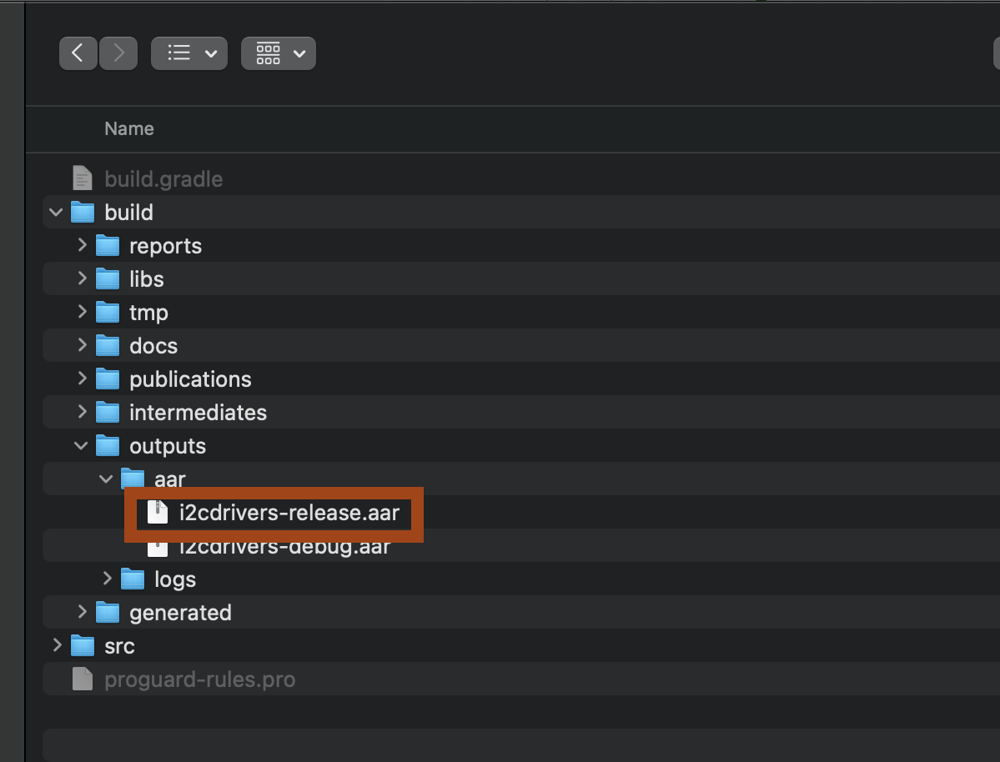
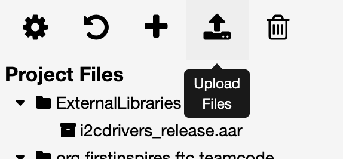
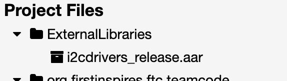

# I2C-Drivers

A collection of I2C drivers for devices not supported out of the box in the FTC SDK.

## Installation instructions for Android Studio Teams

1. Open your FTC SDK Android Studio project

2. Open the `build.gradle` file for the TeamCode module:

   

3. At the bottom, add this:

        dependencies {
            implementation 'org.openftc:i2cdrivers:1.0.1'
         }

4. Now perform a Gradle Sync:

   

5. You're ready to go :)

## Installation instructions for OnBot Java Teams

For those teams using OnBot Java for their season or for prototyping, you may know that when you add I2C drivers to OnBot Java, you then need to reboot the robot every time you change your Java code or it won't find the device.

We didn't like this and you probably don't, either. The solution is to build this project and upload it as an external libary.

### Option 1: Download the pre-built release file (easy)

1. Just download the .aar file from the repository's [releases page](https://github.com/sms-robotics/I2C-Drivers/releases)

### Option 2: Build this project yourself (harder)

1. Open this project in Android Studio

2. Allow it to Gradle sync, etc.

3. You want to run the `I2C-Drivers [build]` configuration. That will produce files in the `build/outputs/aar/` directory as such:

    

### Remaining Steps

1. Now go to OnBot Java.

2. Click the Upload Files button.

    

3. Give it the `i2cdrivers-release.aar` file and wait for it to be ok with what you've done. It will give you a "Close" button.

4. You will now see the library in the `ExternalLibraries` directory: 

   

5. Now you can use the [Sample OpMode](doc/HubTest.java) 

Notice that we can now pull from `org.openftc.i2cdrivers.SRSHub`.

```java
import org.openftc.i2cdrivers.SRSHub;
```

## Changelog:

### v1.0.0

 - Initial release, with a driver for the Qwiic LED stick donated by FTC16072 - Quantum Quacks

### v1.0.1

 - Removal of Qwiic LED stick because it's now officially supported in the SDK.
 - Added support for SRS Hub (https://github.com/Simple-Robotics-System)
 - Updated instructions to support OnBot Java
 - Bump tooling versions to work with Android Studio N 
